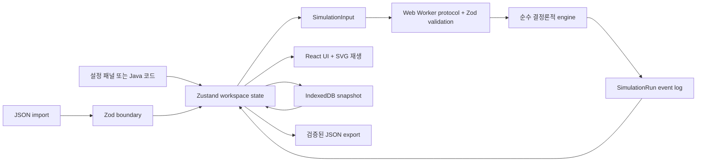

# Event City Lab 프로젝트 상세 기록

## 1. 문서 목적과 현재 상태

이 문서는 Event City Lab의 제품 흐름, 챕터별 구현 상태, 기술적 동작, 검증 결과, 알려진 미비점과 TODO를 관리하는 단일 기록이다.

- 기록 기준일: 2026-08-13
- 기준 브랜치: `main`
- Chapter 1 기준 구현 커밋: `db7e918` (`실패를 도시 배송 경험으로 이해할 수 있게 한다`)
- App version: `0.1.0`
- Content version: `2026.1`
- Kafka rule basis: `4.3.1`
- Storage schema: `1`
- 현재 판정: Chapter 1 기능 흐름과 승인된 단일 도시 배경 기반 시각 개편은 완결. 공개 배포 확인과 자동화된 품질 보강 과제는 남아 있음.

## 2. 제품 목표

Kafka 설정을 설명문으로 외우는 대신 실패를 직접 만들고, 메시지가 멈춘 위치와 로그를 조사하고, 설정을 수정하고, 같은 조건으로 재실행해 결과 차이를 설명하게 하는 gamified learning lab이다.

핵심 학습 반복은 다음과 같다.

```text
설정 확인 → 결과 예측 → 실행 → 실패 관찰 → 증거 조사
→ 원인 진단 → 설정 수정 → 동일 조건 재실행 → 결과 비교 → trade-off 설명
```

### 확정된 제품 제약

- 초기 제품은 PC web 전용이다.
- 지원 viewport는 100% 확대 기준 `1280×720` 이상 `1920×1080` 이하이다.
- “반응형”은 모바일 지원이 아니라 이 PC 범위 내 적응형 밀도와 사용자 인터랙션을 의미한다.
- 진행 저장은 IndexedDB와 localStorage 등 브라우저 로컬 기능만 사용한다.
- backend, 계정, 원격 진도 저장은 현재 범위가 아니다.
- GitHub Pages의 `/event-city-lab/` 하위 경로에서 정적 배포한다.
- 실제 Kafka cluster에 연결하지 않는 결정론적 학습 시뮬레이터다.

## 3. 전체 챕터 방향

| Chapter | 학습 주제 | 상태 |
| --- | --- | --- |
| 1 | 첫 Producer 발송, Serializer 타입 불일치, Broker append, ACK | 기능 구현 완료 |
| 2 | key, partition 선택, partition 내부 ordering | 미구현 |
| 3 | acknowledgements, retry, idempotence | 미구현 |
| 4 | broker, replica, ISR, leader 장애 | 미구현 |
| 5 | consumer, poll, offset commit | 미구현 |
| 6 | consumer group, partition ownership, rebalance | 미구현 |
| 7 | retry topic, backoff, DLT | 미구현 |
| 8 | transaction, consume-transform-produce, 격리 수준 | 미구현 |

Chapter 2 이후의 정확한 실험 시나리오와 설정 조합은 아직 확정하지 않았다. 새 챕터 구현 전에 Kafka 공식 문서 기준과 deprecated 설정 여부를 다시 확인해야 한다.

## 4. Chapter 1 상세 흐름

### 4.1 시작 상태

- Message identity: `order-2401`
- key: `customer-17`
- value type: `OrderEvent`
- topic: `orders.v1`
- acks: `all`
- seed: `2401`
- 최초 `value.serializer`: `StringSerializer`
- 노란 배송 차량은 Producer 출발센터 상차 구역에 주차한다.
- 오른쪽 증거 패널은 실행 전 상태이며 로그는 비어 있다.

사용자는 첫 발송부터 성공하지 못한다. 이 실패는 우연한 장애가 아니라 Serializer가 network 요청보다 먼저 실행된다는 사실을 학습시키기 위한 의도된 시작점이다.

### 4.2 첫 실패 실행

`첫 메시지 보내기` 또는 키보드 `R`을 사용하면 Web Worker가 결정론적 이벤트 기록을 생성하고 UI가 그 기록을 재생한다.

| seq | logical time | component | event | 결과 |
| ---: | ---: | --- | --- | --- |
| 1 | 0ms | producer | `command.accepted` | 발송 명령 접수 |
| 2 | 160ms | producer | `producer.preparing` | ProducerRecord 준비 |
| 3 | 340ms | serializer | `serializer.inspecting` | value 호환성 검사 |
| 4 | 520ms | serializer | `serializer.rejected` | `SerializationException`, 실행 실패 |

실패 표현:

- 차량이 Serializer 검사소 직전에 정지한다.
- 차단기가 닫히고 `OrderEvent ≠ StringSerializer` 표지가 나타난다.
- 검사소 이후 도로는 비활성화된다.
- Broker 수신, append, ACK 이벤트는 생성되지 않는다.
- 오른쪽 패널은 실행당 한 번 `분석` 탭으로 자동 전환한다.
- 진단은 Broker와 network가 아직 관여하지 않았다는 증거를 제공한다.
- 힌트는 관찰 → 범위 → 원리 → 수정의 네 단계로 열린다.

### 4.3 설정 수정과 불변 증거

사용자가 `value.serializer`를 `JsonSerializer`로 바꾸면 설정과 Java code가 양방향으로 동기화된다.

중요한 상태 규칙:

- 이미 끝난 실패 실행은 변경하지 않는다.
- 도시에는 실패 차량, 차단기, 오류 표지를 유지한다.
- 좌측에는 `수정 대기 · 재실행 필요`를 표시한다.
- 새로운 설정은 다음 실행에만 적용한다.

이 규칙은 장애 분석에서 “현재 편집 중인 설정”과 “실제로 실패한 실행의 설정”을 혼동하지 않게 한다.

### 4.4 성공 재실행

같은 message identity와 seed로 재실행하면 다음 이벤트가 생성된다.

| seq | logical time | component | event | 결과 |
| ---: | ---: | --- | --- | --- |
| 1 | 0ms | producer | `command.accepted` | 발송 명령 접수 |
| 2 | 160ms | producer | `producer.preparing` | ProducerRecord 준비 |
| 3 | 340ms | serializer | `serializer.inspecting` | value 호환성 검사 |
| 4 | 520ms | serializer | `serializer.completed` | JSON byte[] 변환 완료 |
| 5 | 760ms | rail | `network.dispatched` | ProduceRequest 출발 |
| 6 | 980ms | broker | `broker.received` | leader Broker 수신 |
| 7 | 1180ms | broker | `broker.appended` | partition log offset 42 기록 |
| 8 | 1380ms | ack | `ack.returned` | acks=all 응답 도착 |
| 9 | 1500ms | producer | `run.completed` | 실험 성공 |

성공 표현:

- 차단기가 열리고 한 대의 차량이 Broker 기록센터 하역장까지 이동한다.
- vehicle identity는 `order-2401`, cargo는 `OrderEvent`, 재실행은 `attempt 2`로 표시한다.
- ACK는 드론이 아니라 Broker에서 Producer 관제실로 전송되는 통신 신호다.
- Producer에 `orders.v1 / partition 0 / offset 42 저장 완료 · acks=all` 도착 문자가 나타난다.
- 오른쪽 패널은 실행당 한 번 `비교` 탭으로 자동 전환한다.
- 실패 실행의 `StringSerializer`와 성공 실행의 `JsonSerializer`를 비교한다.
- ACK 이전 이벤트로 되감으면 도착 문자가 사라진다.

### 4.5 재생과 조사

- 제어: rewind, play/pause, step.
- 속도: 0.5×, 1×, 2×. 결과와 logical time에는 영향을 주지 않는다.
- 1× 성공 재생은 화면 시간으로 약 4초다.
- 타임라인 node를 선택하면 재생을 멈추고 해당 이벤트로 즉시 이동한다.
- reduced motion에서는 checkpoint 사이를 빠르게 전환하고 반복 신호·진동 애니메이션을 제거한다.
- SVG의 Kafka 시설을 선택하면 그 컴포넌트의 최신 이벤트와 관련 설정을 연결한다.

## 5. 화면과 디자인 상태

### 레이아웃

- Header 56px: 브랜드, 챕터, 로컬 저장, 모션, export/import.
- Mission strip 44px: 미션과 성공 조건.
- Main workspace: 좌측 설정, 중앙 도시, 우측 증거의 3열.
- Timeline 약 80–86px.
- Footer 20–22px.
- 페이지 scroll은 숨기고 긴 code와 log만 내부 scroll을 허용한다.

### 시각 언어

- 전체 배경은 warm light gray `#f5f4ef`, 주요 panel은 white.
- 한글 UI는 Google Fonts `Nanum Gothic` 400/700/800과 system fallback을 사용한다.
- 도시의 일반 건물은 pastel 색상이며 상태 의미 색은 cyan, red, green, violet로 제한한다.
- 도시 자산은 외부 Pro 이미지를 복제하지 않은 original inline SVG다.
- Standard view는 Kafka 시설 3개, 일반 건물, park, tree, 화면 밖으로 이어지는 도로를 포함한다.
- Compact, Standard, Wide 구간에서 장식 밀도를 조정한다.

디자인의 상세 source of truth는 `DESIGN.md`다.

## 6. 기술 동작과 데이터 흐름



### 책임 경계

- `src/domain/engine.ts`: Serializer 설정에 따른 실패·성공 event log 생성.
- `src/domain/simulation.ts`: version, core types, default message/config.
- `src/domain/schemas.ts`: runtime validation과 storage/import 경계.
- `src/worker/`: engine을 UI thread 밖에서 실행하고 request/response를 검증.
- `src/state/labStore.ts`: config, runs, cursor, playback, hints, code bridge 상태.
- `src/storage/workspaceDb.ts`: IndexedDB 자동 저장과 JSON 직렬화·역직렬화.
- `src/App.tsx`: hydration, autosave, playback, tabs, user action 연결.
- `src/components/KafkaWorld.tsx`: event state를 pixel 시설·차량, 상태 램프·오류 표지·도착 문자로 투영.
- `src/components/CitySprite.tsx`: 메시지 차량 PNG의 크기·bottom-center anchor·SVG `<image>` 렌더링을 일관되게 관리.
- `src/assets/city/`: 승인된 runtime 도시 배경, 보존 차량 sprite, palette와 manifest 보관.

### 저장 규칙

- Database: `event-city-lab-v1`.
- Object store: `workspace`, key `current`.
- 최대 실행 기록: 최근 20개.
- 저장 debounce: UI 변경 후 약 350ms.
- `ecl:reduced-motion`은 localStorage에 저장한다.
- schema 또는 version이 맞지 않는 snapshot은 현재 복원하지 않고 초기 상태로 돌아간다.

## 7. 배포 구성

- Repository: `advanced-beginner/event-city-lab`
- Remote: `git@github.com-heyyobenji:advanced-beginner/event-city-lab.git`
- Expected URL: `https://advanced-beginner.github.io/event-city-lab/`
- Vite base: `/event-city-lab/`
- GitHub Actions: `.github/workflows/deploy.yml`
- Trigger: `main` push 또는 manual dispatch.
- Pipeline: checkout → Node 24 → `npm ci` → unit test → build → Pages artifact upload → deploy.
- `public/.nojekyll`을 포함한다.
- Chapter URL은 현재 hash `#/chapter/1`을 사용하지만 실제 다중 chapter router는 아직 없다.

## 8. 완료 및 검증 기록

Chapter 1 light-city 구현에서 확인한 내용:

- TypeScript typecheck 통과.
- Vitest 2 files, 6 tests 통과.
- Vite production build 통과.
- `1280×720`, `1440×900`, `1920×1080`에서 page overflow 없음.
- 초기, 실패, 설정 수정 대기, 성공 상태 확인.
- ACK 이전으로 rewind할 때 도착 문자 숨김 확인.
- CodeMirror code tab과 send button이 1280×720에서 함께 표시됨.
- 브라우저 console error 0건.
- 시각 판정 기록은 로컬 `.omx`에 생성했으나 `.gitignore` 대상이므로 저장소에는 포함하지 않는다.

2026-08-13 sprite-city 개편에서 추가로 확인한 내용:

- Stable Diffusion Online sprite 페이지는 형태·외곽선·픽셀 밀도 참고, 사용자 제공 Gemini 이미지는 초기 golden-hour 색감과 도시 활기 참고로만 사용했다.
- 2048×2048 승인 master와 26개 개별 transparent PNG를 생성했다. 원본 참고 이미지는 저장소에 포함하지 않았다.
- 24색 whole-sheet 강제 축소는 지붕과 그림자 품질을 손상해 폐기했다. runtime은 실제 사용 sprite만 import한다.
- 기존 `1000×610` SVG viewBox와 3열 page layout은 유지했다. 시설과 차량 좌표·checkpoint·ACK 경로는 7시–2시 주행축에 맞춰 다시 정렬했다.
- 도로 면을 만들던 대형 SVG stroke와 연결이 보장되지 않던 지선·교차점을 제거했다. 짧은 `road-straight` 반복은 이음새마다 끝 캡이 차도를 덮어 조각처럼 보였기 때문에, 같은 스타일을 유지하면서 양 끝에만 캡이 있는 `road-mainline` 단일 sprite로 교체했다.
- 단일 주도로만 남긴 시안은 도로변 배경과 교통 구조가 부족하다는 판정으로 폐기했다. `road-network-v3`의 사거리 2개를 복원하고 일반 건물 11개를 배치했으나, 시설과 일부 배경 건물이 차도 위에 겹쳐 보이는 문제가 후속 검토에서 확인되었다. 2026-08-18 수정에서는 Producer·Serializer·Broker를 각각 독립된 도로 인접 필지로 옮기고 일반 건물도 차도·보도·횡단보도 밖으로 재배치했다. Serializer는 진입 램프가 오른쪽 하단을 향하는 `facility-serializer-east`로 교체했다. 공원·나무·장식 차량은 제거한 상태를 유지해 건물과 사거리 정렬을 우선했다.
- 메시지 밴은 기존 sprite에 `-29deg` CSS 회전을 중복 적용하던 방식을 폐기했다. 후면이 좌하단, 전면이 우상단을 향하는 `vehicle-kafka-van-northeast`를 새로 생성하고 회전값 `0deg`로 주행시킨다.
- Visual Ralph 판정은 연결된 사거리 2개, 도로 양옆 배경 건물, 주도로변 시설 정렬, 2시 방향 차량을 핵심 기준으로 재설정했다.
- 2026-08-18 도로 이격 재검증은 1280×720과 1920×1080에서 수행했다. 초기·Serializer 실패·Broker 성공 상태 모두에서 핵심 시설 3개와 일반 건물 11개가 도로 면을 침범하지 않았고, 1280×720 문서 크기는 viewport와 동일해 페이지 스크롤이 생기지 않았다.

2026-08-18 단일 도시 배경 전환:

- 사용자가 기존 sprite 조립식 도시를 폐기하고 `Gemini_Generated_Image_ixg878ixg878ixg8.png` 한 장을 최종 도시 배경으로 지정했다.
- 기존 master와 building/facility/road/park/tree 이미지 48개를 프로젝트에서 제거했다. 차량 이미지만 보존했으며 runtime에는 `vehicle-kafka-van-northeast.png` 한 개만 import한다.
- 배경 중앙의 큰 건물 세 개를 왼쪽부터 `1 · 출발센터(Producer)`, `2 · 검사소(Serializer)`, `3 · 기록센터(Broker)`로 매핑한다. 시설 이미지를 추가로 겹치지 않고 투명 상호작용 영역과 상태 표지만 SVG로 올린다.
- 메시지 차량은 배경 중앙 대로 위의 checkpoint를 따라 CSS transform으로 이동한다. ACK 완료 시 배경을 가리지 않는 상단 여백에 도착 문자와 회신 경로를 표시한다.
- 이전 `road-network-v3`, 일반 건물 11개, 방향별 시설 sprite 배치에 관한 기록은 역사적 시도이며 현재 구현 규칙이 아니다.
- 브라우저에서 initial → failure → pending rerun → success → rewind-before-ACK를 실제 조작해 확인했다.
- `1280×720`, `1440×900`, `1920×1080`의 document/root scroll size가 viewport와 일치해 page overflow가 없음을 측정했다.

현재 자동 테스트가 보장하는 범위:

- Serializer 불일치가 network 이전에 실패한다.
- 동일 input은 결정론적으로 재생된다.
- JSON Serializer 성공 경로가 append와 ACK를 포함한다.
- panel 설정과 제한된 Java code의 serializer가 양방향 동기화된다.
- 지원하지 않는 Java code는 이전 설정을 유지하고 warning을 반환한다.

## 9. 알려진 미비점

### 배포와 운영

- `deploy.yml`은 존재하지만 이번 기록 시점에 GitHub Actions 실행 결과와 실제 Pages URL의 최신 화면을 확인한 기록은 없다.
- Pages repository setting이 GitHub Actions source로 활성화되었는지 코드만으로 확인할 수 없다.
- 실제 배포 환경에서 Web Worker asset path, hash URL 복원, Google Fonts CSP/network 동작을 별도로 확인해야 한다.

### 테스트 자동화

- 현재 6개 테스트는 domain/code bridge 중심이다. App, store, storage, worker client, SVG 상태에 대한 자동 테스트가 없다.
- 실패 → 설정 변경 → 재실행 → 비교의 전체 사용자 흐름은 수동 브라우저 검증만 수행했다.
- 세 viewport의 overflow 검사가 CI에서 자동화되지 않았다.
- accessibility 자동 검사와 키보드 전체 경로 회귀 테스트가 없다.
- coverage report 설정은 있으나 threshold가 없다.

### 저장과 복구

- storage schema version은 1뿐이며 migration framework가 없다.
- version이 다른 snapshot은 조용히 무시되고 사용자에게 복구·초기화 이유를 설명하지 않는다.
- IndexedDB quota, private mode, 저장소 손상, 다중 tab 동시 수정에 대한 정책이 없다.
- import/export와 IndexedDB round trip 자동 테스트가 없다.

### 콘텐츠 정확성 및 시뮬레이션 한계

- Chapter 1은 실제 Kafka client나 cluster에 연결하지 않는다.
- partition은 0, leader는 broker-1, append offset은 42로 고정된 학습용 모델이다.
- `acks=all` 성공은 복제본과 ISR 이벤트를 실제로 모델링하지 않고 결과만 설명한다. 이 내용은 Chapter 4에서 보강해야 한다.
- payload 82 bytes, logical time, network 지연은 교육용 고정값이며 실제 성능 수치가 아니다.
- Kafka rule basis `4.3.1`을 선언했지만 각 설명 문장에 대한 공식 문서 citation manifest는 아직 없다.
- 새 Kafka 버전에서 deprecated/removed 설정이 생기는지 주기적으로 확인하는 자동 절차가 없다.

### UI와 접근성

- 모바일과 1280×720 미만 viewport는 의도적으로 지원하지 않는다.
- 브라우저 200% 확대와 Windows/Linux font fallback은 자동 검증하지 않았다.
- Google Fonts 장애 시 fallback 설계는 있으나 실제 offline/network-block 테스트가 없다.
- screen reader에서 SVG 내부의 많은 텍스트가 중복으로 읽히는지 실사용 검증하지 않았다.
- UI가 `App.tsx`, `App.module.css`, `KafkaWorld.tsx`에 크게 집중되어 있어 챕터 확장 전에 추가 분리가 필요하다. 장식 asset mapping은 `CitySprite.tsx`로 분리했다.
- 차량 이동은 이벤트 checkpoint 간 CSS 보간이며 실제 도로 path의 거리 비례 이동은 아니다.

### 라이선스와 고지

- font는 Google 서비스에서 원격 로드하므로 개인정보·네트워크 정책이 필요한 배포 환경에서는 self-host 여부를 다시 결정해야 한다.

## 10. TODO

### P0 — Chapter 1 공개 완료 확인

- [ ] GitHub Actions의 최신 `Verify and deploy Event City Lab` run 성공 여부 확인.
- [ ] 실제 Pages URL에서 initial → failure → pending rerun → success → rewind smoke test.
- [ ] 배포 URL에서 Web Worker와 lazy CodeMirror chunk가 `/event-city-lab/` base로 정상 로드되는지 확인.
- [x] `THIRD_PARTY_NOTICES.md`에 Nanum Gothic과 OFL 고지를 추가.
- [ ] Kafka 4.3.1 공식 문서에 근거한 Chapter 1 citation/reference manifest 작성.

### P1 — 회귀 방지와 유지보수성

- [ ] App integration test: 첫 실패, 분석 탭 자동 전환, 설정 변경 대기, 성공 비교 탭 자동 전환.
- [ ] ACK 이전 rewind에서 도착 문자 미표시 테스트.
- [ ] Zustand hydration과 최대 20개 run 보존 테스트.
- [ ] IndexedDB save/load와 JSON import/export round-trip 테스트.
- [ ] worker protocol error, malformed response, worker failure 테스트와 timeout/cleanup 정책 추가.
- [ ] CI viewport test: 1280×720, 1440×900, 1920×1080 overflow 및 clipping 검사.
- [ ] keyboard-only 및 automated accessibility 검사 추가.
- [ ] coverage threshold 설정.
- [ ] `App.tsx`를 shell, left control, evidence, playback으로 분리.
- [ ] `KafkaWorld.tsx`의 building, facility, vehicle, signal을 속성 기반 컴포넌트로 추가 분리.
- [ ] storage version migration 기본 구조와 사용자 복구 메시지 설계.

### P2 — 다중 챕터 기반

- [ ] chapter metadata registry와 hash router 구현.
- [ ] chapter별 default config, message, learning goal, event schema, hint, comparison definition 분리.
- [ ] 공통 city component와 chapter별 facility/state overlay 경계 정의.
- [ ] 엔진을 chapter별 rule module 또는 scenario definition으로 확장하되 결정론과 schema validation 유지.
- [ ] Chapter 완료 상태와 chapter 간 진도 저장 schema 설계. 이 변경은 storage migration을 포함해야 한다.
- [ ] 전체 챕터 navigation과 잠금·복습 정책 설계.

### P3 — 다음 콘텐츠

- [ ] Chapter 2 요구사항 확정: key, partitioner, partition 내부 ordering의 실패 실험.
- [ ] Chapter 3 요구사항 확정: acks, retry, delivery timeout, idempotence의 상호작용과 중복 위험.
- [ ] Chapter 4 요구사항 확정: broker/replica/ISR 장애와 `acks=all`의 실제 성공 조건.
- [ ] Chapter 5–8은 각 챕터 착수 전에 공식 Kafka 문서와 현재 지원 설정을 다시 조사.

## 11. 다음 작업자가 가장 먼저 할 일

Chapter 1을 공개 상태로 마감하려면 P0를 먼저 수행한다. Chapter 2 구현을 먼저 시작하지 않는다. P0 완료 후 P1 중 integration/E2E와 storage migration 기반을 우선해 다중 챕터 확장 시 Chapter 1이 회귀하지 않도록 한다.

모든 작업 후에는 이 문서의 날짜, 구현 상태, 미비점과 TODO checkbox를 실제 결과에 맞게 갱신한다.
